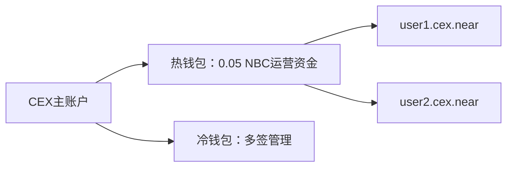
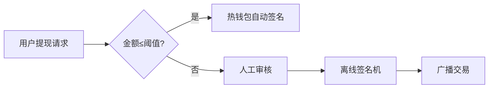

# NBC 对接中心化交易所（CEX）接口文档

以下为 CEX 对接 nbc 钱包的关键接口、使用方式与实现要点，适用于充值、提现、监控与风控处理。

---

##  一、核心接口清单与使用方式

| 功能分类     | 接口/方法                     | 参数示例                                                                 | 使用场景                        | 实现要点                                                     |
|--------------|------------------------------|--------------------------------------------------------------------------|-------------------------------|--------------------------------------------------------------|
| **账户管理** |                              |                                                                          |                               |                                                              |
| `create_account` | 创建子账户               | `{ "new_account_id": "user123.cex.near", "public_key": "ed25519:..." }` | 为用户生成唯一存款地址         | 主账户发起，需预存 0.0012 NBC 押金                          |
| `view_account`   | 查询账户状态             | `{ "account_id": "user123.cex.near" }`                                   | 验证账户是否存在、查询余额     | 返回 `amount`, `storage_usage`                              |
| `add_key`        | 添加多签密钥             | `{ "public_key": "ed25519:...", "access_key": { "permission": "FullAccess" }}` | 设置冷钱包审批权限       | 限定权限或用途                                               |
| **资产操作** |                              |                                                                          |                               |                                                              |
| `send_money`     | NBC 转账                | `{ "receiver_id": "cex.near", "amount": "1000000000000000000000000" }`   | 用户提现                      | 注意 Gas 成本和失败回滚                                      |
| `ft_transfer`    | FT 代币转账（NEP-141）   | `{ "receiver_id": "userx.near", "amount": "1000000", "memo": "withdraw" }` | 处理 USDT、ETH 等代币提现 | 先调用 `storage_deposit` 为接收方充值押金                    |
| `batch_actions`  | 批量操作                 | 多笔 `ft_transfer` 或 `send_money` 组合                                  | 节省 Gas 处理批量提现         | 限 100 Action、Gas 不超 300 TGas                            |
| **交易处理** |                              |                                                                          |                               |                                                              |
| `tx`             | 查询交易状态             | `{ "tx_hash": "9avx...", "sender_id": "user123.near" }`                  | 充值到账确认                  | 解析 `SuccessValue` 或处理 `Failure`                        |
| `EXPERIMENTAL_changes` | 链上事件监听       | `{ "block_id": 12345678, "changes_type": "data_changes", "key_prefix": "receipt" }` | 捕获代币转账事件         | 解析日志 `event:ft_transfer`                                |
| `block`          | 获取区块数据             | `{ "block_id": 12345678 }`                                               | 获取区块、交易列表            | 配合 `chunk` 获取完整数据                                    |
| **安全风控** |                              |                                                                          |                               |                                                              |
| `add_request`     | 多签提现发起请求        | `{ "request": { "receiver_id": "userx.near", "actions": [{ "Transfer": {...} }] } }` | 大额提现申请流程          | 热钱包发起，冷钱包审批 `confirm`                             |
| `EXPERIMENTAL_tx_status` | 交易模拟         | 原始交易 JSON                                                             | 预估交易成功与否              | 检查 Gas 与存储是否足够                                      |

---

##  二、对接实施方案

### 1. 账户体系设计



- 用户子账户统一命名格式 `<user_id>.cex.near`
- 热钱包用于日常充值提现操作
- 冷钱包用于资产存储与审批操作

---

### 2. 提现安全方案

- 小额提现：热钱包直接调用 `send_money` 或 `ft_transfer`
- 大额提现流程：
  1. 热钱包调用多签合约 `add_request`
  2. 冷钱包离线签名执行 `confirm`
  3. 广播交易执行转账

---

##  三、必备条件与合规要点

### 1. 技术依赖

- **SDK：**
  - JS: [near-api-js](https://github.com/near/near-api-js)
  - Python: [near-py](https://github.com/near/near-py)
- **节点服务：**
  - 公共 RPC：`206.238.196.207:3030` / `https://near.lava.build`
  
- **数据索引器：**
  - 使用 NEAR Indexer 自建监听服务，替代频繁 RPC 轮询

---

### 2. 合规与风控

- **存储押金：**
  - 每用户预留 0.0012 nbc
  - 释放空账户以回收存储费用
- **AML 风控：**
  - 接入 Chainalysis 或 TRM Labs 查询地址风险
  - 所有转账 `memo` 字段附带用户 ID 用于审计
- **Gas 费用控制：**
  - 推荐费用公式：0.0001 nbc + 按字节费
  - 主网上限：300 TGas 每交易

---

##  四、推荐工具与测试流程

### 1. 工具推荐

| 类型       | 工具链接                                                                 | 用途               |
|------------|--------------------------------------------------------------------------|--------------------|
| SDK        | [near-api-js](https://github.com/near/near-api-js)                      | 开发集成           |
| 测试网     | [Testnet Faucet](https://testnet.mynearwallet.com/)                     | 申请测试 nbc      |
| 监控平台   | [Pagoda Console](https://console.pagoda.co/)                            | 节点与链监控       |

---

### 2. 测试流程

1. **部署环境：**
   - 测试 RPC：`https://test.rpc.fastnear.com`
   - 账户前缀：如 `cex.testnet`

2. **模拟场景：**
   - 用户向 `user123.cex.testnet` 充值 USDT
   - 热钱包调用 `ft_transfer` 发起提现

3. **压力测试：**
   - 构造 `batch_actions` 并发执行 100 笔交易
   - 监控 RPC 响应时间与 Gas 消耗

---

## 总结

- **账户结构安全隔离**：主账户、热钱包、子账户分层管理
- **事件驱动交易监控**：通过链上 `ft_transfer` 事件监听充值
- **大额交易冷钱包审批**：热钱包发起，冷钱包审批
- **押金与 Gas 成本控制**：动态管理用户账户的存储费用

---

📚 **参考资料**：

- [NEAR RPC 文档](https://docs.near.org/api/rpc)
- [NEP-141 Fungible Token 标准](https://nomicon.io/Standards/FungibleToken/Core)
- [NEAR Core GitHub](https://github.com/near/nearcore)


中心化交易所（CEX）集成 NEAR 公链充提功能的 **完整技术实现方案**，共分 6 个核心步骤，包含关键代码示例和注意事项：

---

### 一、节点部署与同步
#### 1. **部署 NEAR 节点**
```bash
# 安装依赖
sudo apt install -y nodejs git curl
curl --proto '=https' --tlsv1.2 -sSf https://sh.rustup.rs | sh

# 部署归档节点（需 2TB+ SSD）
git clone https://github.com/near/nearcore
cd nearcore
make release
./target/release/neard --home ~/.near init --chain-id mainnet --download-genesis
```

#### 2. **配置 RPC 服务**
```nginx
# Nginx 反向代理配置
server {
    listen 443 ssl;
    server_name near-rpc.yourcex.com;
    location / {
        proxy_pass http://localhost:3030;
        proxy_set_header Host $host;
    }
    ssl_certificate /path/to/cert.pem;
    ssl_certificate_key /path/to/privkey.pem;
}
```

#### 3. **节点监控（Prometheus）**
```yaml
# prometheus.yml 配置
scrape_configs:
  - job_name: 'near_node'
    static_configs:
      - targets: ['node_ip:3030']  # 监控指标端口
```

---

### 二、钱包管理系统开发
#### 1. **HD 钱包架构**
```python
# Python 示例（使用 bip32utils）
from bip32utils import BIP32Key
from bip32utils import BIP32_HARDEN

master_key = BIP32Key.fromEntropy(os.urandom(16))
user_key = master_key.ChildKey(0).ChildKey(user_id + BIP32_HARDEN)
near_address = f"{user_key.Address()}.yourcex.near"
```

#### 2. **冷热钱包分离方案**
| **钱包类型** | **资金比例** | **签名方式** | **安全措施** |
|-------------|-------------|-------------|-------------|
| 热钱包       | <5%         | 自动签名     | 多签+IP白名单 |
| 温钱包       | 10-15%      | 人工审核     | 地理围栏 |
| 冷钱包       | >80%        | 离线签名     | 物理隔离 |

---

### 三、充值监听实现
#### 1. **交易监听脚本**
```javascript
// 使用 near-api-js
const { connect } = require('near-api-js');

const monitorDeposits = async () => {
  const near = await connect({ network: 'mainnet' });
  const blockStream = near.connection.provider.blockStream();
  
  blockStream.subscribe(block => {
    block.transactions.forEach(tx => {
      if (tx.receiver_id.endsWith('.yourcex.near')) {
        processDeposit(tx.sender_id, tx.amount);
      }
    });
  });
};
```

#### 2. **交易确认逻辑**
```python
# 确认数检查（6个区块）
def is_confirmed(tx_hash):
    current_height = get_block_height()
    tx_block = get_tx_block(tx_hash)
    return current_height - tx_block >= 6
```

---

### 四、提现系统实现
#### 1. **提现 API 设计**
```python
# Flask 提现接口示例
@app.route('/withdraw', methods=['POST'])
def withdraw():
    user_id = request.json['user_id']
    amount = Decimal(request.json['amount'])
    address = request.json['address']
    
    # 1. 验证余额
    if not check_balance(user_id, amount):
        return {"error": "Insufficient balance"}, 400
    
    # 2. 构造交易
    tx_hash = create_transaction(
        from_address=get_hot_wallet(),
        to_address=address,
        amount=amount - FEE  # 扣除手续费
    )
    
    # 3. 记录提现
    save_withdrawal(user_id, tx_hash, amount)
    return {"tx_hash": tx_hash}
```

#### 2. **交易签名流程


---

### 五、安全风控系统
#### 1. 风控规则示例
```python
# 风控检查函数
def risk_control(withdraw_request):
    if withdraw_request['amount'] > DAILY_LIMIT[user['level']]:
        return False, "Exceed daily limit"
    
    if is_high_risk_address(withdraw_request['address']):
        return False, "High risk address"
    
    if get_last_withdraw_time(user) < TIME_LIMIT:
        return False, "Too frequent"
    
    return True, ""
```

#### 2. 安全审计要点
1. **私钥存储**：使用 HSM 或 AWS KMS
2. **交易重放保护**：检查 nonce 值
3. **阈值签名**：实现 MPC 钱包
4. **漏洞扫描**：每月进行渗透测试

---

### 六、用户界面集成
#### 1. 前端显示要素
```jsx
// React 充值界面组件
function NearDeposit() {
  return (
    <div>
      <h3>NEAR Deposit</h3>
      <p>Your exclusive address: <b>{user.nearAddress}</b></p>
      <QrCode value={user.nearAddress} size={128} />
      <p>Minimum deposit: 0.01 NEAR</p>
      <TransactionHistory chain="NEAR" />
    </div>
  )
}
```

#### 2. 状态监控看板
| **指标**         | **监控方式**               | **报警阈值**   |
|------------------|--------------------------|---------------|
| 节点同步状态      | Prometheus+AlertManager | 延迟 > 60s    |
| 热钱包余额        | 定时任务                 | < 100 NEAR    |
| 未确认充值        | 数据库扫描               | > 30 分钟     |
| 异常提现尝试      | 日志分析                 | 5次/分钟      |

---

### 关键注意事项
1. **账户创建费**：首次充值到新地址需预留 0.00185 NEAR（当前主网费率）
2. **精度处理**：所有数值计算使用 `BigDecimal` 或 `BN.js`
3. **分片处理**：跨分片交易需特殊处理（使用 `shard_id` 参数）
4. **灾备方案**：
   - 备用 RPC 节点：至少 3 个地理分散节点
   - 自动切换：当主节点延迟 > 5s 时自动切换

> **上线前测试清单**：
> 1. 测试网完整充提流程（10+ 交易）
> 2. 模拟节点故障恢复
> 3. 大额交易压力测试（100+ TPS）
> 4. 安全审计报告验证

通过以上实现，交易所可在 **4-6 周** 内完成 NEAR 集成。建议使用 NEAR 官方提供的 [Exchange Integration Guide](https://docs.near.org/docs/roles/integrator/exchange-integration) 作为补充参考。
